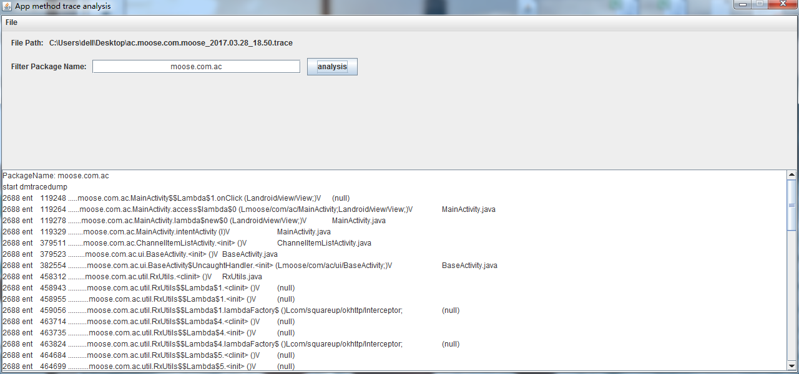

> 背景：当项目代码量很大的时候，或者你作为一名新人要快速掌握代码的时候，给函数打上log，来了解代码执行逻辑，这种方式会显然成本太大，要改动项目编译运行，NO！太耗时；或者你想debug的方式来给你想关注的几个函数，来了解代码执行逻辑，NO！因为你肯定会漏掉函数；也许你可以固执的给你写的项目打满log说这样也行，但是你要知道你方法所调用的jdk的函数或者第三方aar或者jar再或者android sdk中的函数调用顺序你怎么办，还能打log吗？显然不行吧，来~这个项目给让可以让你以包名为过滤点过滤你想要知道所有函数调用顺序。

提醒：本文以及相关库是本人原创，转载请标注原文链接。

项目地址：[https://github.com/zjw-swun/AppMethodOrder](https://github.com/zjw-swun/AppMethodOrder) 欢迎star

作者列表（排名按代码贡献时间顺序）：二精-霁雪清虹，xingstarx，wing，pighead4u <br>

特别鸣谢 ：
[xingstarx]() 同学 ，提供兼容mac和linux的``task AppOutPutMethodOrder``代码<br>
他的github地址:[https://github.com/xingstarx/](https://github.com/xingstarx/) 
<br>
大精-[wing]() 同学，提供兼容不同版本traceview的``task AppFilterMethodOrder``代码<br>
他的github地址：[https://github.com/githubwing](https://github.com/githubwing)<br>
[pighead4u]()同学，提供的``task AppOutPutMethodOrder`` ``task AppFilterMethodOrder``groovy语法重构<br>
他的github地址，[https://github.com/pighead4u](https://github.com/pighead4u)<br>


# 1. 效果奉上


动作简介：首先点击MainActivity的自定义MyTextView然后进入SecondActivity再点击textview之后finish跳转回MainActivity<br>
下面是库处理过所得到的函数调用顺序``order.txt``文件（我这里屏蔽了jdk函数，第三方库函数，以及android sdk中函数，换句话说我就保留了我自己包名中的函数顺序）
```
832 ent     67593 .....com.zjw.appmethodorder.MainActivity.onClick (Landroid/view/View;)V	MainActivity.java
832 ent     99956 ..........com.zjw.appmethodorder.MainActivity.onPause ()V	MainActivity.java
832 ent     99970 ...........com.zjw.appmethodorder.BaseActivity.onPause ()V	BaseActivity.java
832 ent    100472 ............com.zjw.appmethodorder.BaseActivity.baseOnPause ()V	BaseActivity.java
832 ent    128540 ........com.zjw.appmethodorder.SecondActivity.<init> ()V	SecondActivity.java
832 ent    128562 .........com.zjw.appmethodorder.BaseActivity.<init> ()V	BaseActivity.java
832 ent    213911 ........com.zjw.appmethodorder.SecondActivity.onCreate (Landroid/os/Bundle;)V	SecondActivity.java
832 ent    213928 .........com.zjw.appmethodorder.BaseActivity.onCreate (Landroid/os/Bundle;)V	BaseActivity.java
832 ent    258414 ..........com.zjw.appmethodorder.BaseActivity.baseOnCreate ()V	BaseActivity.java
832 ent   1440503 .........com.zjw.appmethodorder.SecondActivity.onResume ()V	SecondActivity.java
832 ent   1440563 ..........com.zjw.appmethodorder.BaseActivity.onResume ()V	BaseActivity.java
832 ent   1445675 ...........com.zjw.appmethodorder.BaseActivity.baseOnResume ()V	BaseActivity.java
832 ent   2954291 .................com.zjw.appmethodorder.MyTextView.onWindowVisibilityChanged (I)V	MyTextView.java
832 ent   3065664 ........com.zjw.appmethodorder.MainActivity.onStop ()V	MainActivity.java
832 ent   3065701 .........com.zjw.appmethodorder.BaseActivity.onStop ()V	BaseActivity.java
832 ent   3069155 ..........com.zjw.appmethodorder.BaseActivity.baseOnStop ()V	BaseActivity.java
832 ent   3139519 .......com.zjw.appmethodorder.SecondActivity.click (Landroid/view/View;)V	SecondActivity.java
832 ent   3146300 ........com.zjw.appmethodorder.SecondActivity.finish ()V	SecondActivity.java
832 ent   3183478 ..........com.zjw.appmethodorder.SecondActivity.onPause ()V	SecondActivity.java
832 ent   3183498 ...........com.zjw.appmethodorder.BaseActivity.onPause ()V	BaseActivity.java
832 ent   3183843 ............com.zjw.appmethodorder.BaseActivity.baseOnPause ()V	BaseActivity.java
832 ent   3209420 ........com.zjw.appmethodorder.MainActivity.<init> ()V	MainActivity.java
832 ent   3209438 .........com.zjw.appmethodorder.BaseActivity.<init> ()V	BaseActivity.java
832 ent   3283359 ........com.zjw.appmethodorder.MainActivity.onCreate (Landroid/os/Bundle;)V	MainActivity.java
832 ent   3283378 .........com.zjw.appmethodorder.BaseActivity.onCreate (Landroid/os/Bundle;)V	BaseActivity.java
832 ent   3330938 ..........com.zjw.appmethodorder.BaseActivity.baseOnCreate ()V	BaseActivity.java
832 ent   4363295 .....................com.zjw.appmethodorder.MyTextView.<init> (Landroid/content/Context;Landroid/util/AttributeSet;)V	MyTextView.java
832 ent   4436094 ..................com.zjw.appmethodorder.MyTextView.onFinishInflate ()V	MyTextView.java
832 ent   4449689 .........com.zjw.appmethodorder.MainActivity.initView ()V	MainActivity.java
832 ent   4539427 .........com.zjw.appmethodorder.MainActivity.onResume ()V	MainActivity.java
832 ent   4539467 ..........com.zjw.appmethodorder.BaseActivity.onResume ()V	BaseActivity.java
832 ent   4543597 ...........com.zjw.appmethodorder.BaseActivity.baseOnResume ()V	BaseActivity.java
832 ent   4917854 .................com.zjw.appmethodorder.MyTextView.onAttachedToWindow ()V	MyTextView.java
832 ent   4918658 .................com.zjw.appmethodorder.MyTextView.onWindowVisibilityChanged (I)V	MyTextView.java
832 ent   5090653 ...................................com.zjw.appmethodorder.MyTextView.onMeasure (II)V	MyTextView.java
832 ent   5355203 ..................................com.zjw.appmethodorder.MyTextView.onMeasure (II)V	MyTextView.java
832 ent   5456681 .......................................com.zjw.appmethodorder.MyTextView.onSizeChanged (IIII)V	MyTextView.java
832 ent   5467577 ....................................com.zjw.appmethodorder.MyTextView.onLayout (ZIIII)V	MyTextView.java
832 ent   5876623 ...........................................com.zjw.appmethodorder.MyTextView.onDraw (Landroid/graphics/Canvas;)V	MyTextView.java
832 ent   6121967 ........com.zjw.appmethodorder.SecondActivity.onStop ()V	SecondActivity.java
832 ent   6121986 .........com.zjw.appmethodorder.BaseActivity.onStop ()V	BaseActivity.java
832 ent   6123689 ..........com.zjw.appmethodorder.BaseActivity.baseOnStop ()V	BaseActivity.java
832 ent   6127522 ........com.zjw.appmethodorder.SecondActivity.onDestroy ()V	SecondActivity.java
832 ent   6127679 .........com.zjw.appmethodorder.BaseActivity.onDestroy ()V	BaseActivity.java
832 ent   6133301 ..........com.zjw.appmethodorder.BaseActivity.baseOnDestroy ()V	BaseActivity.java
```
OK！发现是不是很炫酷啊，下面来介绍该库的原理（求star!!!）
# 2 原理
本库其实并没有什么黑科技，本库也没有java代码，核心就是2个build.gradle中的task。首先，原理就是基于android sdk中提供的工具----traceview，和dmtracedump。traceview会生成.trace文件，该文件记录了函数调用顺序，函数耗时，函数调用次数等等有用的信息。而dmtracedump 工具就是基于trace文件生成报告的工具，具体用法不细说。dmtracedump 工具大家一般用的多的选项就是生成html报告，或者生成调用顺序图片（看起来很不直观）。首先说说为什么要用traceview，和dmtracedump来作为得到函数调用顺序的，因为这个工具既然能知道cpu执行时间和调用次数以及函数调用树（看出函数调用顺序很费劲）比如android studio是这样呈现.trace文件的解析视图的


或者这样的


(上面这张图是网上找的，侵删)
用上面这2个图发现你要清晰知道函数调用看懂了才是见鬼了。或者使用dmtracedump 工具解析生成的html长下面这样（dmtracedump 生成图片就不说了 生成出的图片也根本看不出顺序这个就略过了）


一开始我以为 Method 序列号有戏于是乎冲动的我把带序号的东西内容复制出来写了一个脚本对他们进行排序代码如下：
```
import java.io.BufferedReader;
import java.io.FileReader;
import java.io.IOException;
import java.util.ArrayList;
import java.util.Arrays;
import java.util.Collections;
import java.util.regex.Matcher;
import java.util.regex.Pattern;

public class Sort implements Comparable<Sort> {

	static String uri = "D:/Application/eclipse/javaworkspace/Test/src/JB/1.text";
	String str = "";
	String content = "";

	public Sort(String str,String content) {
		super();
		this.str = str;
		this.content = content;
	}

	public static void main(String[] args) throws IOException {
		// TODO Auto-generated method stub
		
		ArrayList<Sort> list = new ArrayList<>();

		BufferedReader in = new BufferedReader(new FileReader(uri));
		String a = "";

		while ((a = in.readLine()) != null) {
			//System.out.println(Long.valueOf(getIndexStr(a)));
			if(a.contains("com.zjw.appmethodorder")){
			list.add(new Sort(getIndexStr(a),a));
			}
		}
		Collections.sort(list);
		for (Sort sort : list) {
			System.out.println(sort.content);
		}
	}

	public static String getIndexStr(String str) {
		String regEx = "(?<=\\[)(\\S+)(?=\\])";// 匹配[]中的数字
		Pattern p = Pattern.compile(regEx);
		Matcher m = p.matcher(str.trim());
		while (m.find()) {
			return m.group().trim();
		}
		return "";
	}

	@Override
	public int compareTo(Sort o) {
		// TODO Auto-generated method stub
		//return 0;
		return (int) (Long.valueOf(str) - Long.valueOf(o.str));
	}

}
```
结果发现过滤后的东西序列号是按顺序的但是并不是代码执行的逻辑顺序。我擦怎么办，工具代码也写了，居然不是我想要的结果，好在花了一些时间发现dmtracedump -ho 选项，经过研究发现，这玩意输出的内容居然是按逻辑顺序从上到下的，于是基于这一点我写一个项目，其实核心就是2个task完成了了解所有函数调用顺序的目的。
```
//核心任务：在captures文件目录下输出 基于最新.trace文件的函数调用信息的txt版本
//说明：dmtracedump 为 android sdk自带工具，要执行dmtracedump命令则需要先添加环境变量
task AppOutPutMethodOrder() {
    doLast {
        def capturesDirPath = project.getProjectDir().getParentFile().path + File.separator + "captures";
        def capturesDir = new File(capturesDirPath);
        capturesDir.traverse {
            if (it.isFile() && it.name.endsWith(".trace")) {
                def orderName = it.name.replace("trace", "txt")
                def orderFile = new File(capturesDirPath, orderName)

                //说明：dmtracedump 为 android sdk自带工具，要执行dmtracedump命令则需要先添加环境变量
                def baseComand = "dmtracedump  -ho " + it.absolutePath + " >> " + orderFile.absolutePath
                println baseComand
                String osNameMatch = System.getProperty("os.name").toLowerCase();
                if (osNameMatch.contains("windows")) {
                    ("cmd /c start  /b " + baseComand).execute()
                } else {
                    ["bash", "-c", baseComand].execute()
                }
            }
        }
    }
}


//这里AppFilterMethodOrder 任务其实也不需要 执行找到 \captures 目录找到 base_order.txt
//用Notepad++ 使用正则 先过滤 带 xit 的行 （我们只关注ent 行就行，ent代表进入执行函数　xit代表退出函数）再过滤掉你不关心的包名
// Notepad++ 中过滤将会使用到的命令行如下
//^.*xit.*$ //去除掉 含有 xit 字符串的行  然后替换为空
// ^((?!XXX).)*$  //去除不包含XXX的行  然后替换为空
//^\s+   //合并空行  然后替换为空
task AppFilterMethodOrder() {
    doLast {
        //TODO 替换为你想要过滤的包名
        def filterPackageName = "com.zjw.appmethodorder"
	if (project.hasProperty("package_name")) {
            filterPackageName = project.getProperty("package_name")
        }
        //处理包名
        def filterSignature = filterPackageName.replaceAll("[.]", "/")

        def capturesDirPath = project.getProjectDir().getParentFile().path + File.separator + "captures";
        def capturesDir = new File(capturesDirPath);

        capturesDir.traverse {
            if (it.isFile() && it.name.endsWith(".txt") && !it.name.contains("--filter")) {
                def orderName = it.name.replace(".txt", "--filter.txt")
                def orderFile = new File(capturesDirPath, orderName)

                it.eachLine { line ->

                    if (line.contains(" ent ")
                        //兼容不同版本traceview 有的是方法包名有的是方法签名
                    && (line.contains(filterPackageName)
                    || line.contains(filterSignature))
                    ) {
                        println line
                        orderFile.append(line + "\n")
                    }

                }
            }
        }

    }
}
```

# 3.如何使用
讲了一堆原理我们来说说这个库怎么用吧。

注意：请先确保 anroid sdk 中的dmtracedump 工具加入在你的环境变量中(Mac同学因为task面板执行的bug 需要把gradle添加到环境变量中)

首先编译运行项目，然后点击下图的时钟（这是使用工具打trace start 和 end）进行操作，可以参考上文所说的动作简介（记住你操作想想你的生命周期函数调用顺序，待会可以和生成的captures目录下base_order.txt或者生成的order.txt中的函数顺序做做对比）然后再点一次下图那个时钟。还有一种记录trace start 和 end的方式就是在修改代码,即使用``android.os.Debug.startMethodTracing();``和``android.os.Debug.stopMethodTracing();``

以上操作完成后即会在captures目录生成``com.zjw.appmethodorder_2017.03.25_21.41.trace``文件，android studio会默认打开一个可视化窗口


然后双击右侧面板的 ``AppOutPutMethodOrder``任务 （特别注意：用Mac的同学注意了，现在已知双击执行task会输出空文件，貌似是studio的BUG，可以使用 ``./gradlew AppOutPutMethodOrder``执行该任务）如下图


这一步完成就将在``captures``目录生成和trace文件同名的txt文件(如示例``com.zjw.appmethodorder_2017.03.25_21.41.trace``)，该文件包含所有函数执行顺序

等待任务执行完成，再双击执行``AppFilterMethodOrder``任务 （特别注意：用Mac的同学注意了，现在已知双击执行task会输出空文件，貌似是studio的BUG，可以使用 ``./gradlew AppFilterMethodOrder -P package_name=com.zjw.appmethodorder ``执行该任务）如下图窗口


该任务目的就是过滤其他非相关包名，留下自己包名的函数，任务执行完成将在``captures``目录生成和·``trace``文件同名+``--filter.txt``文件(例如示例``AppMethodOrder\captures\com.zjw.appmethodorder_2017.03.25_21.41--filter.txt``)
如下图：


接下来打开``trace``文件同名+``--filter.txt``文件(例如示例``AppMethodOrder\captures\com.zjw.appmethodorder_2017.03.25_21.41--filter.txt``)就是上文效果中的那样啦。

# 4.关于扩展和改造


这里改成你想要过滤的包名即可。

# 5.小工具
``Windows 环境下`` 可使用tool文件夹下的``Method-trace-analysis.jar`` 直接导入`.trace文件`，一键分析


